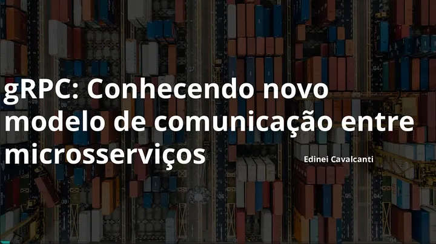

# ⚙️gRPC and Microservices: A Workshop Overview

Grpc é um farmwork para comunição muito comum em microsserviços utilizado por empresas como Dropbox, Netflix, Cisco,
Spotify, Docker, Google entre outras… venho por meio desses mostrar os slides do workshop apresentado dia 06/11/2019 na
Agile Content para o time GVP (Global videio platform).

Conteúdo:

01. Microsserviços
    O que é? Conceitos. Comunicação síncrona e assíncrona.
02. HTTP/2
    O que é? Principais benefícios e desvantagens.
03. Protocol buffers aka Protobuf
    O que é? Vantagens em relação a outros formatos.
04. gRPC ❤️
    O que é? Conceitos. Por que eu gostaria de usar o gRPC? Demo 😈.

- [Link do workshop](https://speakerdeck.com/neiesc/grpc-conhecendo-novo-modelo-de-comunicacao-entre-microsservicos)
- [Link para feedback](https://edineicavalcanti.typeform.com/to/LoejEP?typeform-source=edinei.dev)
- [Link para exemplo no github](https://github.com/neiesc/talks/tree/main/Grpc-workshop)