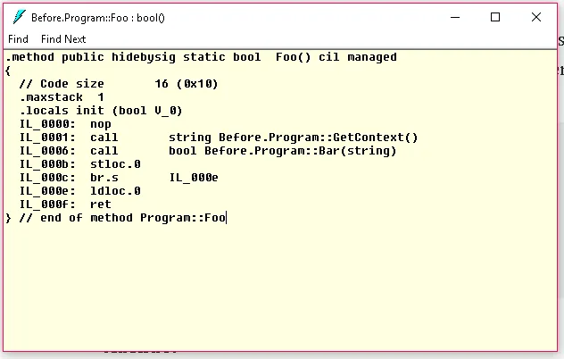
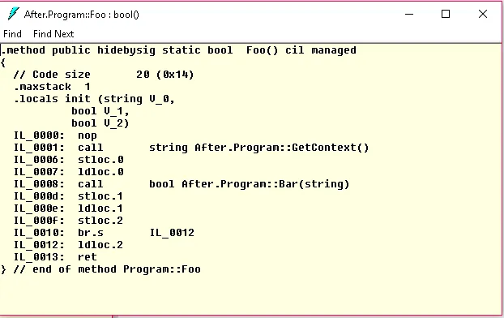
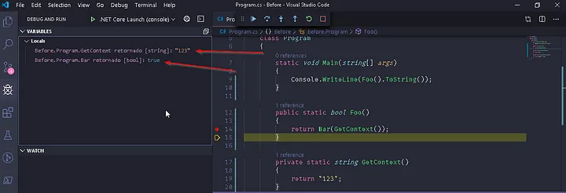

# 💡Depuração e refatoração de código C# para manutenção


## Índice

1. [Introdução](#introducao)
2. [Aprofundando](#aprofundando)
3. [Os return-values](#return-values)
4. [Conclusão](#conclusao)

## Introdução <a name="introducao"></a>

Imagine o seguinte código:

```csharp
public bool Foo()
{
    return Bar(GetContext());
}
```

Ele possui alguns ruidos que dificultam manutenções e debug um deles é o `GetContext()` ser passado como paramêtro
diretamente para o `Bar(string context)` o outro seria você estar dando o return direto do resultado de
`Bar(stringcontext)`, esses dois pontos somados dificultando o debug nessa função, pense que seu **breakpoint** esteja
em
`return Bar(GetContext());` e você deseja entrar em `Bar(string context)` você precisará apertar F10 (para pular
`GetContext())` e
depois
F11, imagine também que você deseje saber o valor de `Foo()` antes de retornar possível edição do valor para debug,
teriamos mais trabalho, agora vamos **refatorá-lo**:

```csharp
public bool Foo()
{
    var context = GetContext();
    var bar = Bar(context);
    return bar;
}
```

Opa mas pera ai ainda tem uma coisa que me incomoda sem quando tenho um return eu gosto de pular uma linha antes. Então
a versão final ficará:

```csharp
public bool Foo()
{
    var context = GetContext();
    var bar = Bar(context);

    return bar;
}
```

## Aprofundando <a name="aprofundando"></a>

A versão antes da refatoração é mais otimizada para os compiladores mas dificulta a letura do codigo desse cenário que
você está no método `Foo()` e quer debugar Bar(string context), veja
o [linguagem intermediária (IL)](https://en.wikipedia.org/wiki/Common_Intermediate_Language) do C# nas duas versões:

- IL antes da refatoração
  
- IL depois da refatoração
  

## Os return-values <a name="return-values"></a>

Também temos os **return-values** no Visual Studio Code, Visual Studio e na maioria das IDEs como contrapontos dessa
argumentação.



## Conclusão <a name="conclusao"></a>

Agora sim fizemos um pequeno refatoração que poupará algum tempo de debug e manutenção e melhoria na leitura do código
pois podemos dar mais significância mas variáveis `context` e `bar`. Apesar dos contrapontos.