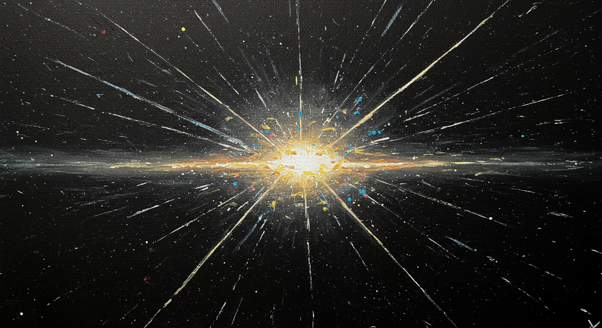

# 💿Você ainda vende CDs!

## Índice

1. [Introdução](#introdução)
2. [Bravo Mundo Novo](#bravo-mundo-novo)
6. [Conclusão](#conclusão)

## Introdução

Sim os disco compacto, disco compacto a laser, disco a laser, compacto laser ou simplesmente disco laser (popularmente
conhecido por CD, sigla para a designação inglesa, Compact Disc) criado em 1982 no Japão.

Eles ainda não morreram e sabe porquê? porque vivemos em diferentes mundos as vezes estaremos parados na tecnologia
porque nossos clientes estão e isso é muito ruim porque vc não está no estado da arte (DVD -> HD DVD, Disco
Blu-ray -> [Archival Disc](https://pt.wikipedia.org/wiki/Archival_Disc))
Mas isso sai da "linha física" e passa para os Streamming (Spotify (2008), Deezer, Tidal, etc...)
com [mais de 70 milhões de musicas](https://newsroom.spotify.com/company-info/).

## Bravo Mundo Novo

O ponto que quero chegar é se você está no mundo dotnet e ainda dá manutenção em sistema com ~~.NET Full Framework~~,
você já está atrasado para o **bravo mundo novo** .NET Core (que teve início em 2016) onde temos diversas melhorias e
possibilidade de rodar tanto no Windows quanto em outros sistemas operacionais como **GNU/Linux ou macOS**.

## Conclusão

**Se você ainda ficar vendendo CD** talvez seja porque seus clientes não buscam **crescimento, evolução e melhoramento
contínuo**, porque
a tecnologia impacta em todas as áreas com **disrupção**, cuidado com os clientes que você tem pois seu atual/futuro
comcorente concorrente pode estar se preparando para o **bravo mundo novo** para fazer de maneira **disruptiva** como (
Uber,
Nubank, Ifood, etc... ).