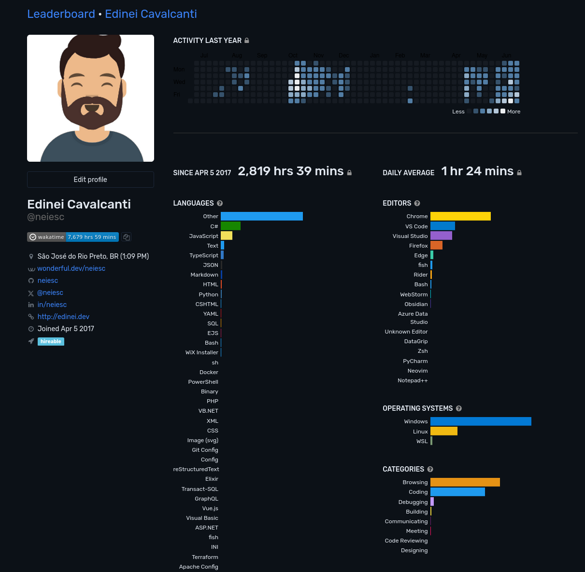
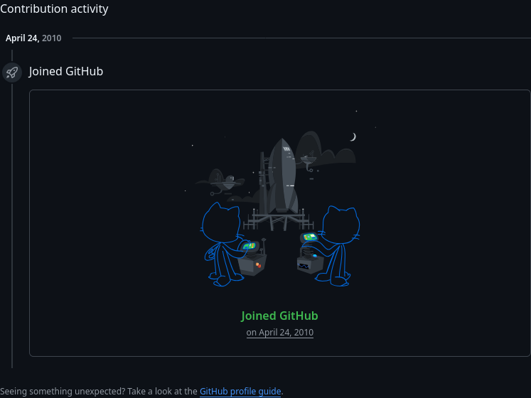
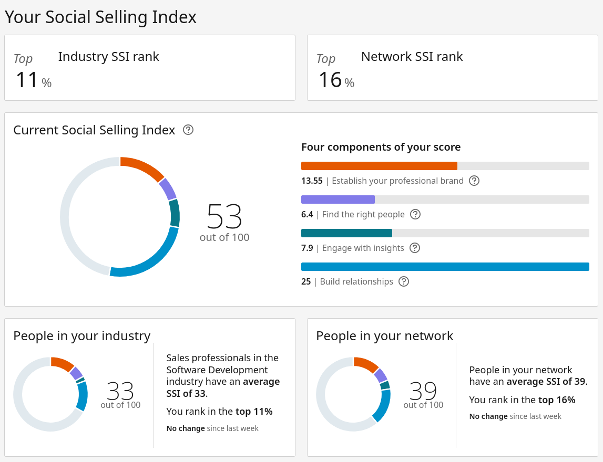
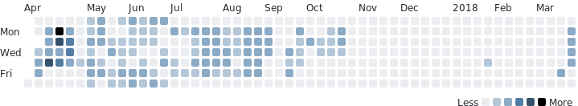

# 🔮"Se eu pudesse falar com meu 'eu' de 15 anos atrás… o que eu diria?"

Depois do post de o que [eu diria para meu 'eu' de 10 anos atrás](https://edinei.dev/dez-anos-atras.html)... agora vamos mais meia decada, 15 anos atrás para o 'eu'...

## Quanto mais estudamos, mas sabemos que precisamos estudar?
O estudo é uma mina a ser explorada pelos mais curiosos seres, somos pensantes e pensadores, uso o wakatime desde 2017, não está totalmente atualizado mas representa esses 8 anos de registros nele, e meu github desde 2010 ou seja desde meu início como programador.

## Amadurecimento vem com o tempo ou com experiencias diferentes?
## Sonhar, sonhar e sonhar...
## Querer e poder?
## Conectar, conexao conectado

## ..futuro e o presente e o presente ja passou...

