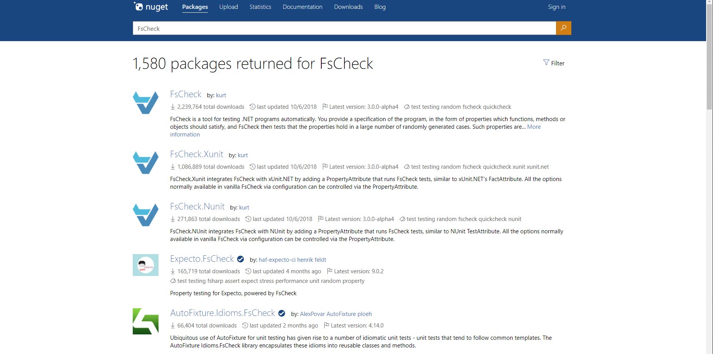

# 🧪A Essência dos Testes: Qualidade e Valor no Software
## Por que fazer testes?

Você compraria um carro sem ter sido feito testes nele?

Pensando a médio e longo prazo, testes não são opcionais, mas sim obrigatórios, diretamente de MVP e POCs.

Nos testes de carro não usamos pessoas reais, mas sim dummies (manequins), assim como nos de software, que usamos mock ou stub.

Testes bem feitos adicionam valor. Testes ruins são apenas custo.

> O teste de programas pode ser usado para mostrar a presença de bugs, mas nunca para mostrar a sua ausência! - Edsger Dijkstra

## Testes na vida real

](media/2026-03-14-tests1.png)

[https://quatrorodas.abril.com.br/noticias/fiat-mobi-ganha-uma-estrela-em-teste-de-impacto/](https://quatrorodas.abril.com.br/noticias/fiat-mobi-ganha-uma-estrela-em-teste-de-impacto/)

](media/2026-03-14-tests2.png)

[https://www.voovirtual.com/t11763-localizacao-de-tubos-de-pitot-e-sensores-de-transmissao-e-sidestiks-airbus](https://www.voovirtual.com/t11763-localizacao-de-tubos-de-pitot-e-sensores-de-transmissao-e-sidestiks-airbus)

Aviões têm mais redundância de sensores do que precisariam.

## Pirâmide de testes

/](media/2026-03-14-tests3.png)

[https://www.eximiaco.tech/pt/2020/05/08/que-tipo-de-teste-escrever-para-reduzir-o-custo-total-de-um-projeto-de-software](https://www.eximiaco.tech/pt/2020/05/08/que-tipo-de-teste-escrever-para-reduzir-o-custo-total-de-um-projeto-de-software/)

## A adoção de testes automatizados de aceitação para melhorar o alinhamento do time técnico com o negócio

](media/2026-03-14-tests4.png)

[https://www.eximiaco.tech/pt/2020/04/24/a-adocao-de-testes-automatizados-de-aceitacao-melhora-o-alinhamento-do-time-tecnico-com-o-negocio/](https://www.eximiaco.tech/pt/2020/04/24/a-adocao-de-testes-automatizados-de-aceitacao-melhora-o-alinhamento-do-time-tecnico-com-o-negocio/)

## Unit Testing:Principles, Practices and Patterns

](media/2026-03-14-tests5.png)

[https://www.eximiaco.tech/pt/2020/04/10/unit-testing-principles-practices-and-patterns/](https://www.eximiaco.tech/pt/2020/04/10/unit-testing-principles-practices-and-patterns/)

O argumento do autor é que nem todos os testes são iguais, por isso devemos questionar a existência de cada teste a partir da ótica do negócio, ou senão, estará somente aumentando o custo de ~~code coverage~~.

## Growing Object-Oriented Software, Guided By Tests (Escola de Londres)

](media/2026-03-14-tests6.png)

[https://www.eximiaco.tech/pt/2019/08/02/growing-object-oriented-software-guided-by-tests/](https://www.eximiaco.tech/pt/2019/08/02/growing-object-oriented-software-guided-by-tests/)

## TDD 2.0

](media/2026-03-14-tests7.png)

[https://sttp.site/chapters/getting-started/developer-testing-workflow.html](https://sttp.site/chapters/getting-started/developer-testing-workflow.html)

## Property-Based Testing

O Teste Baseado em Propriedade trata de generalizar a entrada para podermos fazer declarações sobre a saída; sem especificar exatamente como a entrada ou saída deve ser, apenas deve ser semelhante.

[https://www.codit.eu/blog/property-based-testing-with-c/](https://www.codit.eu/blog/property-based-testing-with-c/)

[https://github.com/fscheck/FsCheck](https://github.com/fscheck/FsCheck)

### Conheçendo FsCheck

[https://dev.to/thawkin3/clean-code-with-unit-tests-tips-and-tricks-for-keeping-your-test-suites-clean-483l](https://dev.to/thawkin3/clean-code-with-unit-tests-tips-and-tricks-for-keeping-your-test-suites-clean-483l)

## Continua... 

🤔 Artigo idealizado em 8 de fevereiro de 2021 e so publicado agora 🙏.
